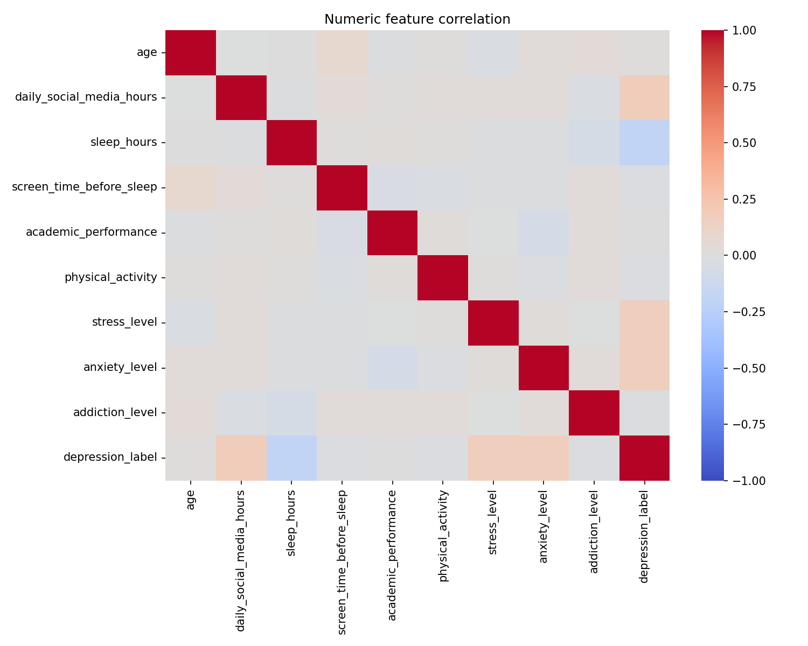

# Task 1 - Data Collection and Dataset Understanding

This folder contains the clean version of **Task 1** for your GitHub repository.

Repository link: [DecodeLabs Internship Projects](https://github.com/Buduthaharishreddy/DecodeLabs--Internship-projects-)
GitHub repository: https://github.com/Buduthaharishreddy/DecodeLabs

## Goal

Collect or load the dataset and understand its structure.

## Dataset

- File name: `Teen_Mental_Health_Dataset.csv`
- Rows: `1200`
- Columns: `13`

## Folder structure

```text
Task-1/
├─ data/
├─ README.md
├─ requirements.txt
├─ task1_simple.py
├─ generate_report.py
└─ outputs/
```

The dataset is stored inside `Task-1/data/` so the folder is self-contained for GitHub. The scripts also keep a fallback to the repository root copy if you run them from another location.

## Files you need for this task

1. `Teen_Mental_Health_Dataset.csv` - the dataset.
2. `task1_simple.py` - beginner-friendly script that prints the basic structure.
3. `generate_report.py` - creates a polished PDF report.
4. `requirements.txt` - required Python packages.
5. `outputs/` - folder where generated reports are saved.

## File check

Click these files to verify the full Task-1 setup:

- [Dataset](data/Teen_Mental_Health_Dataset.csv)
- [Simple script](task1_simple.py)
- [PDF report script](generate_report.py)
- [Requirements](requirements.txt)
- [Simple text output](outputs/simple_report.txt)
- [PDF output](outputs/analysis_report.pdf)
- [Task-1 README](README.md)

## Step-by-step explanation

### Step 1 - Load the dataset

The script reads the CSV file with `pandas.read_csv()`.

### Step 2 - Check dataset size

The script prints the number of rows and columns using `df.shape`.

### Step 3 - Check column names and data types

The script prints `df.dtypes` so you can see which columns are numeric and which are categorical.

### Step 4 - View sample rows

The script displays the first 5 rows with `df.head()`.

### Step 5 - Check missing values

The script counts missing values with `df.isnull().sum()`.

### Step 6 - Study categorical columns

The script shows top values for columns like `gender`, `platform_usage`, and `social_interaction_level`.

### Step 7 - Study numeric columns

The script prints summary statistics for numeric columns using `df.describe()`.

### Step 8 - Generate a report

The script writes the results into a report file so you can add it directly to GitHub.

## Features in this task

- Dataset loading
- Column and type identification
- Dataset size checking
- Missing value checking
- Categorical value overview
- Numeric summary
- PDF report generation
- Output folder creation

## Important output files

- `outputs/simple_report.txt` - text summary
- `outputs/analysis_report.pdf` - polished report with tables and charts

## Output preview

The project also includes a visual output from the analysis:



## How to run

From the repository root:

```bash
pip install -r Task-1/requirements.txt
python Task-1/task1_simple.py
python Task-1/generate_report.py
```

## What the output means

- The table of dtypes tells you what kind of data is in each column.
- The missing-value count tells you whether the dataset is clean.
- The category counts show which values appear most often.
- The numeric summary helps you understand the range and average of each numeric feature.
- The PDF report combines all important output into one file.

## Short conclusion

This dataset is ready for exploratory data analysis because it already has clear numeric and categorical columns, no missing values in the sample output, and a target-style label column called `depression_label`.
